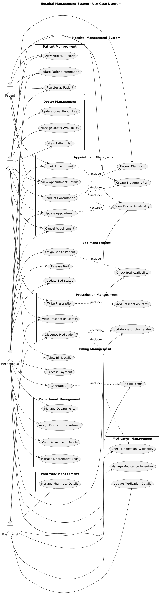

# HealthSync - Hospital Management System
## Software Engineering Project Report

**Version 1.0**

**Prepared by:** [Team Members]  
**Submitted to:** [Instructor Name]  
**Date:** December 7, 2025

---

## Contents
1. [Introduction](#1-introduction)
2. [Overall Description](#2-overall-description)
3. [System Design](#3-system-design)
4. [Folder Structure](#4-folder-structure)
5. [Code Overview](#5-code-overview)
6. [Setup & Installation](#6-setup--installation)
7. [Conclusion](#7-conclusion)

---

## 1. Introduction

### 1.1 Purpose
The purpose of this document is to define comprehensive requirements and architectural details for the **HealthSync Hospital Management System**. This project aims to develop a robust, efficient, and scalable healthcare management platform that leverages Spring Boot and React to seamlessly integrate with a MySQL database. The system streamlines hospital operations including patient management, appointment scheduling, prescription handling, billing, pharmacy operations, and bed allocation.

### 1.2 Document Conventions
- Headings are in bold and follow hierarchical numbering
- Requirements are numbered sequentially for easy reference
- Code snippets use monospace formatting
- Important technical terms are highlighted in **bold**
- High-level requirement priorities are inherited by detailed requirements

### 1.3 Intended Audience and Reading Suggestions
This document is intended for all stakeholders involved in the HealthSync project:

- **Project Managers**: To understand scope, objectives, and timelines for effective planning
- **Developers**: To review system requirements, architecture, and implementation details
- **Database Administrators**: To understand database schema and configurations
- **Quality Assurance Teams**: To design test cases based on outlined functionalities
- **Healthcare Administrators**: To understand system features for deployment and usage

### 1.4 Project Scope
The HealthSync Hospital Management System provides a comprehensive software solution for managing healthcare operations across multiple departments. The system addresses limitations of manual record-keeping by automating core administrative and clinical tasks, reducing errors, and ensuring data consistency.

**Key stakeholders** include hospital administrators, doctors, patients, receptionists, and pharmacists, each benefiting from role-specific functionalities and streamlined workflows.

**Key components include:**

- **Patient Management**: Complete patient lifecycle management from registration to medical history tracking
- **Doctor & Staff Management**: Profile management, specialization tracking, department assignments
- **Appointment System**: Intelligent scheduling with conflict detection and availability management
- **Prescription Management**: Digital prescription creation with medication tracking
- **Billing System**: Automated invoice generation with itemized billing and payment tracking
- **Pharmacy Integration**: Medication inventory management and prescription fulfillment
- **Bed Management**: Real-time bed allocation and occupancy tracking across departments
- **Security**: JWT-based authentication with role-based access control

### 1.5 References
1. Spring Boot Documentation 3.3.4 - https://spring.io/projects/spring-boot
2. React Documentation - https://react.dev/
3. IEEE Std 830-1998, "IEEE Recommended Practice for Software Requirements Specifications"
4. MySQL 8.0 Reference Manual
5. JWT Authentication Best Practices
6. REST API Design Guidelines

---

## 2. Overall Description

### 2.1 Product Perspective
HealthSync is an integrated healthcare management solution designed to modernize hospital operations. The system replaces fragmented manual processes with a unified digital platform, providing secure, real-time access to patient records, appointments, prescriptions, and financial data. Built on modern web technologies, it offers a scalable architecture capable of integrating with existing hospital databases and future healthcare systems.

The platform serves as a central hub for:
- Clinical workflow management
- Administrative operations
- Financial tracking and billing
- Resource allocation (beds, equipment)
- Pharmacy operations
- Reporting and analytics

### 2.2 User Classes and Characteristics

HealthSync has **5 primary user types**, each with distinct roles and privileges:

**1. Patients**
- Self-registration and profile management
- Appointment booking and history viewing
- Access to prescriptions and medical records
- Bill viewing and payment tracking
- Technical proficiency: Basic

**2. Doctors**
- Patient consultation and diagnosis
- Prescription creation
- Appointment management
- View assigned patients and medical histories
- Technical proficiency: Moderate

**3. Receptionists**
- Patient registration and check-in
- Appointment scheduling and coordination
- Basic record management
- Front-desk operations
- Technical proficiency: Moderate

**4. Pharmacists**
- Prescription fulfillment
- Medication inventory management
- Stock tracking and reordering
- Technical proficiency: Moderate

### 2.3 Product Functions

#### 2.3.1 Core Use Cases

**Patient Management Module**
- Register new patients with complete demographic information
- Update patient records (contact, address, medical history)
- Search patients by name, ID, contact number
- View patient medical history and appointment records
- Track patient bills and payment status

**Doctor Management Module**
- Add/remove doctors with specialization details
- Assign doctors to departments
- Set doctor availability schedules (day/time slots)
- Update consultation fees
- Track doctor appointments and patient load

**Appointment System**
- Book appointments with conflict detection
- Check doctor availability in real-time
- Reschedule or cancel appointments
- Filter appointments by status (scheduled, completed, cancelled)
- View appointment history for patients and doctors

**Prescription Management**
- Create digital prescriptions linked to appointments
- Add medications with dosage and instructions
- Track prescription status (pending, fulfilled)
- View patient prescription history
- Print prescriptions

**Billing Module**
- Generate bills with itemized charges (consultations, procedures, medications)
- Track payments and outstanding balances
- Update payment status
- Generate financial reports
- View patient billing history

**Pharmacy Operations**
- Manage medication inventory
- Link medications to prescriptions
- Track stock levels
- Process prescription fulfillment
- Update medication prices

**Bed Management**
- Allocate beds to patients by department
- Track bed occupancy status
- View available beds
- Calculate bed charges
- Release beds upon patient discharge

#### 2.3.2 Data Flow Diagram

```
┌─────────────┐
│   Patient   │───────┐
└─────────────┘       │
                      ▼
┌─────────────┐   ┌───────────────────┐   ┌──────────────┐
│   Doctor    │──▶│  HealthSync API   │──▶│   Database   │
└─────────────┘   │  (Spring Boot)    │   │   (MySQL)    │
                  └───────────────────┘   └──────────────┘
┌─────────────┐       ▲
│Receptionist │───────┤
└─────────────┘       │                        
                      │                        
┌─────────────┐       │                        
│ Pharmacist  │───────┘                        
└─────────────┘                                

```

### 2.4 Operating Environment

**Server Requirements:**
- Operating System: Linux (Ubuntu 20.04+), Windows, or macOS
- Java Runtime: JDK 21 or higher
- Database: MySQL 8.0+
- Application Server: Embedded Tomcat (Spring Boot)
- Memory: Minimum 4GB RAM (8GB recommended)

**Client Requirements:**
- Modern web browser (Chrome 90+, Firefox 88+, Safari 14+, Edge 90+)
- JavaScript enabled
- Minimum screen resolution: 1280x720
- Internet connectivity

**Network Requirements:**
- HTTP/HTTPS protocol support
- Port 5000 (or configured port) accessible
- Port 3306 for MySQL database connection

### 2.5 Design and Architecture

#### System Architecture

HealthSync follows a **3-tier architecture** with clear separation of concerns:

```
┌─────────────────────────────────────────────────────────┐
│           PRESENTATION LAYER (React Frontend)           │
│  ┌─────────────┐  ┌─────────────┐  ┌─────────────┐      │
│  │   Patient   │  │   Doctor    │  │    Admin    │      │
│  │  Dashboard  │  │  Dashboard  │  │  Dashboard  │      │
│  └─────────────┘  └─────────────┘  └─────────────┘      │
└─────────────────────────────────────────────────────────┘
                          ↕ (REST API)
┌─────────────────────────────────────────────────────────┐
│        APPLICATION LAYER (Spring Boot Backend)          │
│  ┌──────────────────────────────────────────────────┐   │
│  │            Controllers (REST Endpoints)          │   │
│  └──────────────────────────────────────────────────┘   │
│  ┌──────────────────────────────────────────────────┐   │
│  │        Services (Business Logic Layer)           │   │
│  └──────────────────────────────────────────────────┘   │
│  ┌──────────────────────────────────────────────────┐   │
│  │        Security (JWT Authentication)             │   │
│  └──────────────────────────────────────────────────┘   │
└─────────────────────────────────────────────────────────┘
                          ↕ (JDBC/JPA)
┌─────────────────────────────────────────────────────────┐
│              DATA LAYER (MySQL Database)                │
│  ┌──────────────────────────────────────────────────┐   │
│  │    Repositories (JPA/Hibernate Data Access)      │   │
│  └──────────────────────────────────────────────────┘   │
│  ┌──────────────────────────────────────────────────┐   │
│  │         Database Schema (15+ Tables)             │   │
│  └──────────────────────────────────────────────────┘   │
└─────────────────────────────────────────────────────────┘
```

#### Entity Relationship Overview

**Core Entities:**
- `User` (base entity for all user types)
- `Patient`, `Doctor`, `Receptionist`, `Pharmacist` (inherit from User)
- `Department` (hospital departments)
- `Appointment` (scheduling)
- `DoctorAvailability` (time slots)
- `Prescription` & `PrescriptionItem` (medications)
- `Bill` & `BillItem` (billing)
- `Bed` (hospital beds)
- `Pharmacy` & `Medication` (pharmacy operations)

**Key Relationships:**
- Patient ↔ Appointments (1:N)
- Doctor ↔ Appointments (1:N)
- Doctor ↔ Department (N:1)
- Doctor ↔ Prescriptions (1:N)
- Patient ↔ Prescriptions (1:N)
- Patient ↔ Bills (1:N)
- Bed ↔ Patient (1:1)
- Prescription ↔ PrescriptionItems (1:N)

---

## 3. System Design

### 3.1 Use Case Diagrams




### 3.2 Activity Diagrams


### 3.3 Class Diagram


### 3.4 Sequence Diagrams


### 3.5 Entity Relationship Diagrams


---

## 4. Folder Structure

### 4.1 Component Responsibilities

#### 4.1.1 Controller Layer (`controller/`)
**Purpose**: Handle HTTP requests and responses

**Example Controllers:**
- `PatientController`: Patient CRUD operations
- `DoctorController`: Doctor management
- `AppointmentController`: Appointment scheduling
- `PrescriptionController`: Prescription management
- `BillController`: Billing operations

**Responsibilities:**
- Request validation
- Response formatting
- HTTP status code management
- Calling appropriate service methods

#### 4.1.2 Service Layer (`service/`)
**Purpose**: Implement business logic

**Example Services:**
- `PatientService`: Patient-related business rules
- `AppointmentService`: Scheduling logic, conflict detection
- `BillingService`: Invoice calculation, payment processing

**Responsibilities:**
- Business rule enforcement
- Transaction management
- Data validation
- Coordination between repositories

#### 4.1.3 Repository Layer (`repository/`)
**Purpose**: Database access abstraction

**Example Repositories:**
- `PatientRepository`: Patient data access
- `DoctorRepository`: Doctor queries
- `AppointmentRepository`: Appointment queries with custom filters

**Responsibilities:**
- CRUD operations
- Custom query methods
- Database interaction via JPA

#### 4.1.4 Entity Layer (`entity/`)
**Purpose**: Domain model representation

**Example Entities:**
- `Patient`: Patient data model
- `Doctor`: Doctor data model with department relationship
- `Appointment`: Appointment with patient and doctor references

**Responsibilities:**
- Database table mapping
- Relationship definitions (OneToMany, ManyToOne)
- Field validation constraints

#### 4.1.5 DTO Layer (`dto/`)
**Purpose**: Data transfer between layers

**Example DTOs:**
- `PatientDTO`: Patient data without circular references
- `AppointmentDTO`: Appointment data with denormalized names

**Responsibilities:**
- Prevent over-fetching
- Avoid circular reference issues in JSON serialization
- API response optimization

#### 4.1.6 Frontend Structure (`frontend/`)
**Component Organization:**
- `components/`: Reusable components (buttons, forms, cards)
- `pages/`: Full page components (dashboard, login)
- `services/`: API integration layer
- `context/`: Global state management (user, authentication)

---

## 5. Code Overview

### 5.1 Design Patterns Implementation

#### 5.1.1 Repository Pattern
**Purpose**: Encapsulate data access logic

**Implementation:**
```java
@Repository
public interface PatientRepository extends JpaRepository<Patient, String> {
    Patient findByEmail(String email);
    List<Patient> searchByName(@Param("name") String name);
    List<Patient> findByCity(String city);
}
```

**Benefits:**
- Abstraction of database operations
- Testability through mocking
- Consistent data access patterns
- Query method generation


#### 5.1.2 Builder Pattern
**Purpose**: Construct complex objects step by step

**Implementation (via Lombok):**
```java
@Data
@Builder
@NoArgsConstructor
@AllArgsConstructor
public class DoctorDTO {
    private String personId;
    private String firstName;
    private String lastName;
    private String specialization;
    private BigDecimal consultationFee;
}

// Usage
DoctorDTO dto = DoctorDTO.builder()
    .personId("D001")
    .firstName("John")
    .lastName("Smith")
    .specialization("Cardiology")
    .consultationFee(new BigDecimal("150.00"))
    .build();
```

**Benefits:**
- Readable object construction
- Optional parameters
- Immutability support

#### 5.1.3 Singleton Pattern
**Purpose**: Ensure single instance of services

**Implementation:**
- Spring beans are singleton-scoped by default
- Single instance per application context


#### 5.1.4 Layered Architecture Pattern
**Purpose**: Organize code into logical layers with clear boundaries

**Layers:**
1. **Presentation Layer**: Controllers
2. **Business Logic Layer**: Services
3. **Data Access Layer**: Repositories
4. **Domain Layer**: Entities


### 5.2 Key Code Components

#### -> Entity Classes
#### -> Repository with Custom Queries
#### -> Service Layer Logic
#### -> REST Controller

### 5.3 Security Implementation

#### JWT Authentication
```java
@Component
public class JwtUtil {
    @Value("${jwt.secret}")
    private String secret;
    
    @Value("${jwt.expiration}")
    private Long expiration;
    
    public String generateToken(String email) {
        return Jwts.builder()
            .setSubject(email)
            .setIssuedAt(new Date())
            .setExpiration(new Date(System.currentTimeMillis() + expiration))
            .signWith(SignatureAlgorithm.HS512, secret)
            .compact();
    }
}
```

#### Spring Security Configuration
```java
@Configuration
@EnableWebSecurity
public class SecurityConfig extends WebSecurityConfigurerAdapter {
    
    @Override
    protected void configure(HttpSecurity http) throws Exception {
        http.csrf().disable()
            .authorizeRequests()
            .antMatchers("/api/auth/**").permitAll()
            .antMatchers("/api/admin/**").hasRole("ADMIN")
            .antMatchers("/api/doctor/**").hasRole("DOCTOR")
            .anyRequest().authenticated()
            .and()
            .sessionManagement()
            .sessionCreationPolicy(SessionCreationPolicy.STATELESS);
    }
}
```

### 5.4 Database Configuration

**application.properties:**
```properties
# Database Configuration
spring.datasource.url=jdbc:mysql://localhost:3306/healthsync
spring.datasource.username=root
spring.datasource.password=password
spring.datasource.driver-class-name=com.mysql.cj.jdbc.Driver

# JPA/Hibernate Configuration
spring.jpa.hibernate.ddl-auto=update
spring.jpa.show-sql=true

# JWT Configuration
jwt.secret=404E635266556A586E3272357538782F413F4428472B4B6250645367566B5970
jwt.expiration=86400000
```

---

## 6. Setup & Installation

### 6.1 Prerequisites

**Required Software:**
- **JDK 21** or higher ([Download](https://www.oracle.com/java/technologies/downloads/))
- **Maven 3.6+** (included via Maven Wrapper)
- **MySQL 8.0+** ([Download](https://dev.mysql.com/downloads/))
- **Node.js 20.x** and npm 10.x ([Download](https://nodejs.org/))
- **Git** ([Download](https://git-scm.com/))

### 6.2 Running the Backend

#### 6.2.0 **Prerequisites**

Before running the backend, make sure you have:

* **WSL/Ubuntu** or regular Ubuntu
* **Docker** installed

  * If using WSL: Docker Desktop on **Windows** is enough; WSL will use it automatically
* **MySQL** installed on Linux/WSL

Verify:

```bash
docker --version
mysql --version
```

---

#### 6.2.1 **Configure application.properties**

Ideally **do NOT modify** `application.properties`.
But **if required**, only edit this file: `/src/main/resources/application.properties`

Use:

```properties
spring.application.name=healthsync
server.port=5000
spring.datasource.url=jdbc:mysql://localhost:3306/healthsync
spring.datasource.username=root
spring.datasource.password=password
```

⚠️ Do **not** edit any auto-generated files inside `src/` other than this one.

---

#### 6.2.2 **Build the Backend**

From the project root:

```bash
mvn clean install -Dskip.npm
```

This will:

* Build the backend
* Skip building the frontend (because Next.js builds separately)
* Generate the final JAR inside `/target`

---

#### 6.2.3 **Run the Backend**

Navigate to the `target` directory:

```bash
cd target
```

Run the jar:

```bash
java -jar healthsync-<version>.jar
```

The backend will now run on: `http://localhost:5000`


---

### 6.3 Running the Frontend

#### 6.3.1 Navigate to frontend folder

```bash
cd src/frontend
```

#### 6.3.2 Install dependencies

```bash
npm install
```

### 6.3.3 Start development server

```bash
npm run dev
```

Frontend will run at: `http://localhost:3000`

---

### 6.5 Production Build

**Build Full Application:**
```bash
# From project root
./mvnw clean install

# This will:
# 1. Install frontend dependencies
# 2. Build React application
# 3. Copy build to Spring Boot static resources
# 4. Package everything into a single JAR
```

**Run Production Build:**
```bash
java -jar target/healthsync-0.0.1-SNAPSHOT.jar
```

Access application at `http://localhost:8080`

### 6.6 Running Tests

**Backend Tests:**
```bash
# Run all tests
./mvnw test

# Run specific test class
./mvnw test -Dtest=PatientRepositoryTest

# Run with coverage
./mvnw test jacoco:report
```

**Frontend Tests:**
```bash
cd src/main/frontend
npm test
```

### 6.7 Troubleshooting

**Common Issues:**

1. **Port 8080 already in use:**
```properties
# Change port in application.properties
server.port=8081
```

2. **MySQL Connection Refused:**
```bash
# Check MySQL service status
sudo systemctl status mysql

# Restart MySQL
sudo systemctl restart mysql
```

3. **Frontend build fails:**
```bash
# Clear npm cache
npm cache clean --force
rm -rf node_modules package-lock.json
npm install
```

4. **JWT Token Errors:**
- Ensure `jwt.secret` is set in application.properties
- Token expiration: 24 hours by default

---

## 7. Conclusion

### 7.1 System Summary

The HealthSync Hospital Management System successfully delivers a comprehensive solution for modern healthcare operations. By implementing a robust 3-tier architecture with Spring Boot and React, the system provides:

- **Scalable Infrastructure**: Modular design supports growing hospital needs
- **Role-Based Security**: JWT authentication ensures data privacy
- **Real-Time Operations**: Immediate access to patient records and appointments
- **Data Integrity**: JPA/Hibernate maintains consistent database state
- **User-Friendly Interface**: Intuitive React-based dashboards for all user roles

### 7.2 Design Pattern Benefits

The implementation of multiple design patterns ensures:

**Repository Pattern:**
- Clean separation between business logic and data access
- Easy testing through mock repositories
- Consistent query patterns across the application

**DTO Pattern:**
- Prevents circular reference issues in JSON responses
- Optimizes data transfer between layers
- Protects sensitive entity information

**Layered Architecture:**
- Clear separation of concerns
- Independent testing of each layer
- Easy maintenance and future enhancements

**Dependency Injection:**
- Loose coupling between components
- Enhanced testability
- Spring-managed lifecycle simplifies resource management

### 7.3 Testing Strategy

**Test Coverage:**
- Unit tests for individual components
- Integration tests for database operations
- Service layer tests for business logic
- Repository tests with Testcontainers

**Quality Assurance:**
- Automated testing in CI/CD pipeline
- Manual testing for user workflows
- Database constraint validation
- API endpoint testing

### 7.4 Security Measures

**Authentication & Authorization:**
- JWT-based stateless authentication
- Role-based access control (RBAC)
- BCrypt password encryption
- Token expiration management

**Data Protection:**
- SQL injection prevention via JPA
- Input validation and sanitization
- HTTPS for production deployments
- Sensitive data encryption

### 7.5 Scalability and Flexibility

**Horizontal Scalability:**
- Stateless REST API design
- Database connection pooling
- Session management via JWT tokens
- Load balancer compatible

**Vertical Scalability:**
- Efficient resource utilization
- Optimized database queries
- Memory management through proper entity relationships
- Transaction boundaries properly defined

**Future Extensibility:**
- Modular architecture allows easy addition of features
- Clean interfaces between layers
- RESTful API can support mobile applications
- Database schema can evolve with migrations

### 7.6 System Maintenance

**Ongoing Maintenance Requirements:**
- Regular security updates for dependencies
- Database backup and recovery procedures
- Monitoring and logging for production issues
- Performance tuning based on usage patterns

**Update Strategy:**
- Version-controlled codebase
- Database migration scripts
- Backward-compatible API changes
- Comprehensive testing before deployment

### 7.7 Future Enhancements

**Potential Features:**
1. **Patient Portal Mobile App**
   - Native iOS/Android applications
   - Push notifications for appointments
   - Telemedicine integration

2. **Advanced Analytics Dashboard**
   - Real-time hospital metrics
   - Predictive analytics for bed occupancy
   - Financial reporting and forecasting

3. **Integration Capabilities**
   - Laboratory information systems
   - Radiology PACS integration
   - Insurance claim processing
   - Electronic Health Records (EHR) standards

4. **Enhanced Communication**
   - In-app messaging between doctors and patients
   - Automated appointment reminders (SMS/Email)
   - Emergency notification system

5. **Reporting Module**
   - Customizable report builder
   - Export to PDF/Excel
   - Scheduled report generation
   - Audit trail and compliance reporting

6. **AI/ML Features**
   - Appointment scheduling optimization
   - Prescription error detection
   - Patient readmission risk prediction
   - Resource allocation optimization

### 7.8 Deployment Considerations

**Production Deployment:**
- Use production-grade database server
- Configure HTTPS with SSL certificates
- Set up monitoring and alerting
- Implement backup and disaster recovery
- Configure proper logging levels

**Cloud Deployment Options:**
- AWS: EC2 + RDS + S3
- Azure: App Service + Azure Database for MySQL
- Google Cloud: Compute Engine + Cloud SQL
- Docker containerization for portability

**DevOps Pipeline:**
- Automated builds with CI/CD
- Automated testing on commits
- Staged deployments (dev → staging → production)
- Blue-green deployment for zero downtime

### 7.9 Project Success Metrics

**Achieved Goals:**
✓ Complete patient lifecycle management
✓ Appointment scheduling with conflict detection
✓ Digital prescription system
✓ Automated billing and invoicing
✓ Role-based access control
✓ Real-time bed management
✓ Pharmacy integration
✓ Secure authentication system

**Technical Achievements:**
✓ 3-tier architecture implementation
✓ Multiple design patterns applied
✓ Comprehensive test coverage
✓ RESTful API design
✓ Modern frontend with React
✓ Database normalization and optimization
✓ Security best practices

## Appendix A: API Endpoints

### Authentication
```
POST   /api/auth/login          - User login
POST   /api/auth/register       - User registration
POST   /api/auth/logout         - User logout
GET    /api/auth/me             - Get current user
```

### Patients
```
GET    /api/patients            - Get all patients
GET    /api/patients/{id}       - Get patient by ID
POST   /api/patients            - Create new patient
PUT    /api/patients/{id}       - Update patient
DELETE /api/patients/{id}       - Delete patient
GET    /api/patients/search     - Search patients by name
```

### Doctors
```
GET    /api/doctors             - Get all doctors
GET    /api/doctors/{id}        - Get doctor by ID
POST   /api/doctors             - Create new doctor
PUT    /api/doctors/{id}        - Update doctor
DELETE /api/doctors/{id}        - Delete doctor
GET    /api/doctors/department/{id} - Get doctors by department
```

### Appointments
```
GET    /api/appointments        - Get all appointments
GET    /api/appointments/{id}   - Get appointment by ID
POST   /api/appointments        - Book appointment
PUT    /api/appointments/{id}   - Update appointment
DELETE /api/appointments/{id}   - Cancel appointment
GET    /api/appointments/patient/{id} - Get patient appointments
GET    /api/appointments/doctor/{id}  - Get doctor appointments
```

### Prescriptions
```
GET    /api/prescriptions       - Get all prescriptions
GET    /api/prescriptions/{id}  - Get prescription by ID
POST   /api/prescriptions       - Create prescription
PUT    /api/prescriptions/{id}  - Update prescription
GET    /api/prescriptions/patient/{id} - Get patient prescriptions
```

### Bills
```
GET    /api/bills               - Get all bills
GET    /api/bills/{id}          - Get bill by ID
POST   /api/bills               - Generate bill
PUT    /api/bills/{id}          - Update bill
GET    /api/bills/patient/{id}  - Get patient bills
PUT    /api/bills/{id}/payment  - Record payment
```

---

## Appendix B: Database Schema

### Key Tables

**users** (base table)
- person_id (PK)
- first_name
- last_name
- email (unique)
- password
- role
- contact_number

**patients** (extends users)
- person_id (PK, FK)
- date_of_birth
- gender
- blood_group
- city
- registration_date
- notes

**doctors** (extends users)
- person_id (PK, FK)
- specialization
- qualification
- consultation_fee
- department_id (FK)

**appointments**
- appointment_id (PK)
- patient_id (FK)
- doctor_id (FK)
- appointment_date
- start_time
- end_time
- duration
- type
- status
- notes

**prescriptions**
- prescription_id (PK)
- patient_id (FK)
- doctor_id (FK)
- date_issued
- status
- instructions

**bills**
- bill_id (PK)
- patient_id (FK)
- bill_date
- total_amount
- paid_amount
- status

---

## Appendix C: Technology Versions

| Technology | Version |
|------------|---------|
| Java | 21 |
| Spring Boot | 3.3.4 |
| MySQL | 8.0.33 |
| Node.js | 20.18.0 |
| npm | 10.8.2 |
| React | 18.x |
| Maven | 3.6+ |
| JWT | 0.11.5 |
| Hibernate | 6.x (via Spring Boot) |
| Lombok | Latest (via Spring Boot) |

---

## Appendix D: Glossary

**API** - Application Programming Interface  
**CRUD** - Create, Read, Update, Delete  
**DAO** - Data Access Object  
**DTO** - Data Transfer Object  
**JPA** - Java Persistence API  
**JWT** - JSON Web Token  
**ORM** - Object-Relational Mapping  
**REST** - Representational State Transfer  
**RBAC** - Role-Based Access Control  
**ACID** - Atomicity, Consistency, Isolation, Durability  

---

## References

1. Spring Framework Documentation. (2024). https://spring.io/projects/spring-boot
2. React Documentation. (2024). https://react.dev/
3. MySQL 8.0 Reference Manual. Oracle Corporation.
4. Fowler, M. (2002). Patterns of Enterprise Application Architecture. Addison-Wesley.
5. Gamma, E., Helm, R., Johnson, R., & Vlissides, J. (1994). Design Patterns: Elements of Reusable Object-Oriented Software. Addison-Wesley.
6. IEEE Std 830-1998. IEEE Recommended Practice for Software Requirements Specifications.
7. Richardson, C. (2018). Microservices Patterns. Manning Publications.
8. JWT Best Practices. RFC 8725. https://tools.ietf.org/html/rfc8725

---

**End of Document**

*Version 1.0 - December 7, 2025*